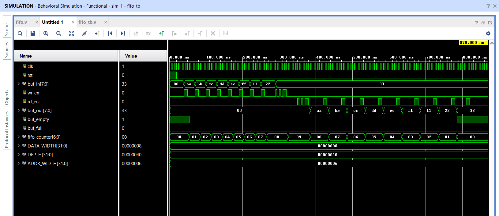

<h1>📦 Parameterized FIFO Buffer – Verilog Implementation</h1>  
✅ Summary  
This project implements a parameterized synchronous FIFO (First-In First-Out) buffer in Verilog HDL.  
It supports configurable DATA_WIDTH, DEPTH, and corresponding ADDR_WIDTH. 
The design ensures reliable data transfer with edge-detected write and read pulses and dynamic buf_empty and buf_full status flags. 

<h1>Key features include:</h1> 
Parameterized data width and depth. 
FIFO counter to monitor occupancy level. 
Debounce and edge detection using 2-bit synchronizers (wr_sync, rd_sync) for stable input control signals. 
Separate read (rd_ptr) and write (wr_ptr) pointers for managing memory access. 
Memory implemented as a register array (buf_mem) for simulation, which can be mapped to block RAM on FPGAs. 
Outputs buf_empty, buf_full, and current fifo_counter value. 

## 📊 FIFO Simulation Waveform

Below is the simulation waveform showing FIFO write and read operations:

